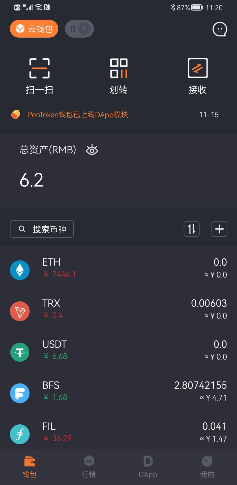
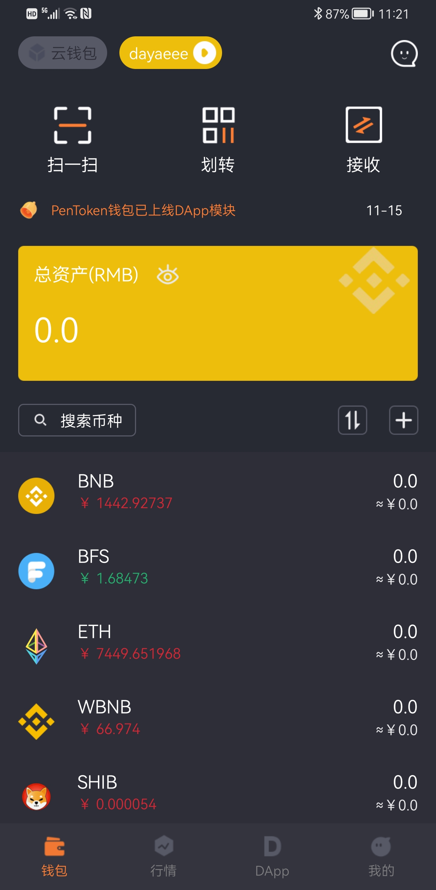
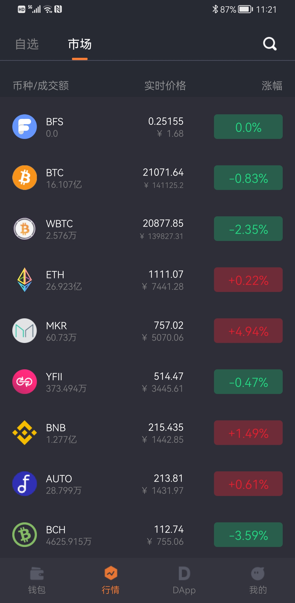

## 联系方式
discord: https://discord.gg/Aep6Jr74K5

telegram: https://t.me/Gannhua

## What is Digital Asset Wallet?

数字资产钱包是Java版开源的虚拟货币工具包，未来预计会支持更多的虚拟货币币种。

## 案例 :triangular_flag_on_post:
PenToken钱包：云钱包后台使用Java开发，链接地址：<a href="https://www.auroralab.io/">PenToken钱包</a>

> Due to my busy work, the update will be very slow (mainly because few people use it). Now I am developing a java version of AR wallet and consider converting the official example Scala version to Java.

Thank you for your star. I will write some of my knowledge about digital wallet and blockchain on my blog and display it directly in the warehouse.

### 示例代码：

```java
/**
     * 执行合约方法 {查询代币符号、发行量、name等}
     * @param contractAddress 需要查询的合约地址
     * @param <F> 返回类型
     * @param <T> 合约方法放回类型 (as specified by {@link Type})
     * @param input 输入参数 比如查询balanceOf
     * @param fun 指定需要查询的执行方法
     */
    @SuppressWarnings("rawtypes")
    public static <T extends Type<?>,F> F sendContractInfo(String contractAddress,List<TypeReference<?>> input, ContractFun fun, Class<F> returnType, Class<T> c){
        final Function function = new Function(fun.getFunName(),
                input,
                Collections.singletonList(TypeReference.create(c)));
        String encode = FunctionEncoder.encode(function);
        try {
            EthCall send = web3j.ethCall(Transaction.createEthCallTransaction("0x0000000000000000000000000000000000000000", contractAddress, encode),
                    DefaultBlockParameterName.LATEST).send();
            List<Type> results = FunctionReturnDecoder.decode(send.getValue(), function.getOutputParameters());
            if (results.size()>0){
                // 类型转换
                return Convert.convert(returnType,results.get(0).getValue().toString());
            }
            return null;
        } catch (IOException e) {
            log.error("=====> 合约方法查询执行失败 ",e);
            return null;
        }
    }
```
简单示列：

 |  | 
---｜---｜---


